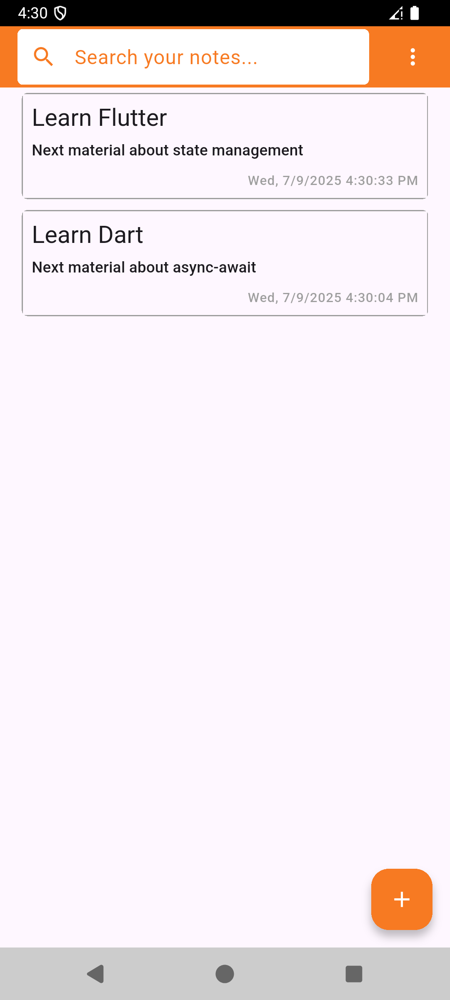
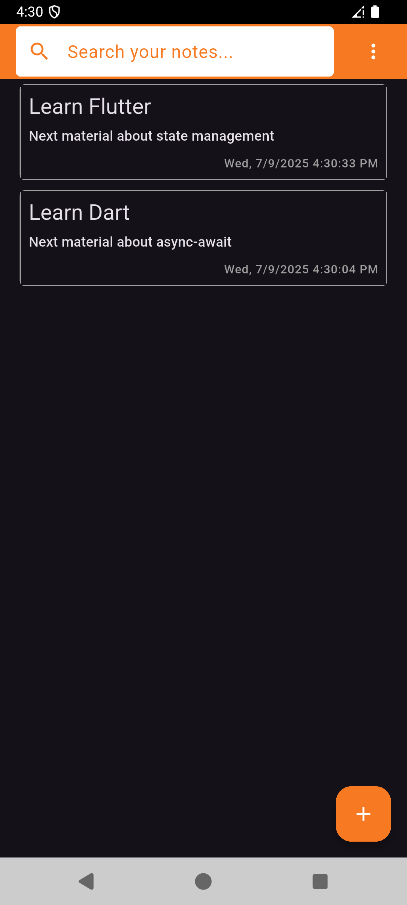
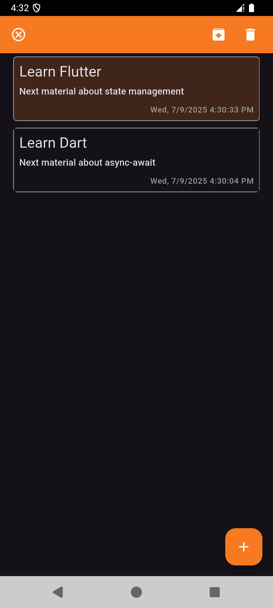
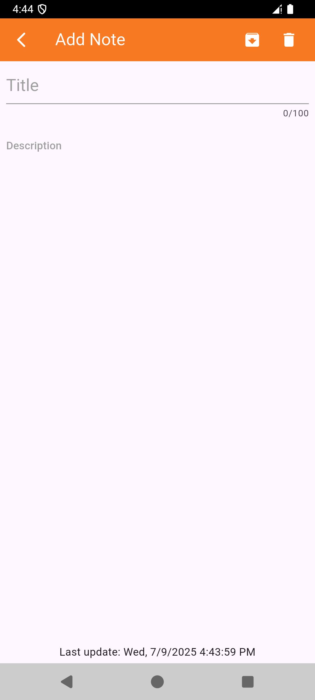
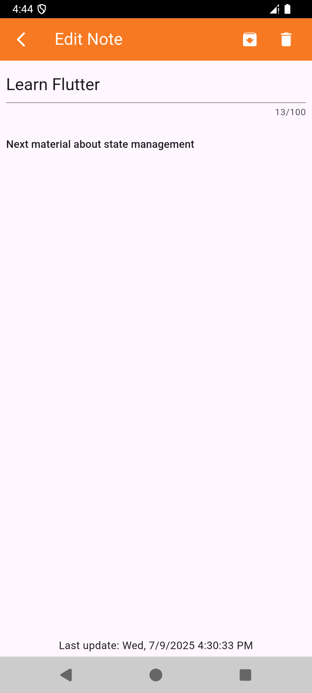
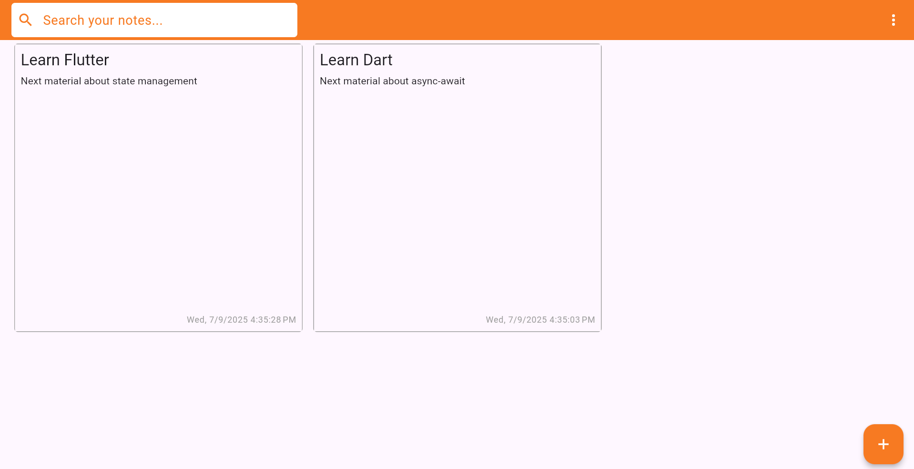

# Notes App

Notes App is a simple and user-friendly application for taking and managing notes. Key features include:
- Archiving and unarchiving notes
- Support for light and dark mode
- Tap and hold on a note to access additional options
- Local data storage using the shared_preferences plugin
- Debounced auto-save functionality every 2 seconds
- Responsive design for device mobile and desktop

## Preview












## Setup Project in Terminal
1. Clone repository GitHub to local
```
git clone https://github.com/KevinWinardi/notes-app
```
2. Change directory to the notes-app
```
cd notes-app
```
3. Install dependecies
```
flutter pub get
```

## How to Run Project in VS Code
1. Press Ctrl + Shift + P
2. Type and select Flutter: Select Device
3. Select an active emulator or physical device from the list
3. Click menu bar Run -> Run Without Debugging or use the shortcut Ctrl + F5